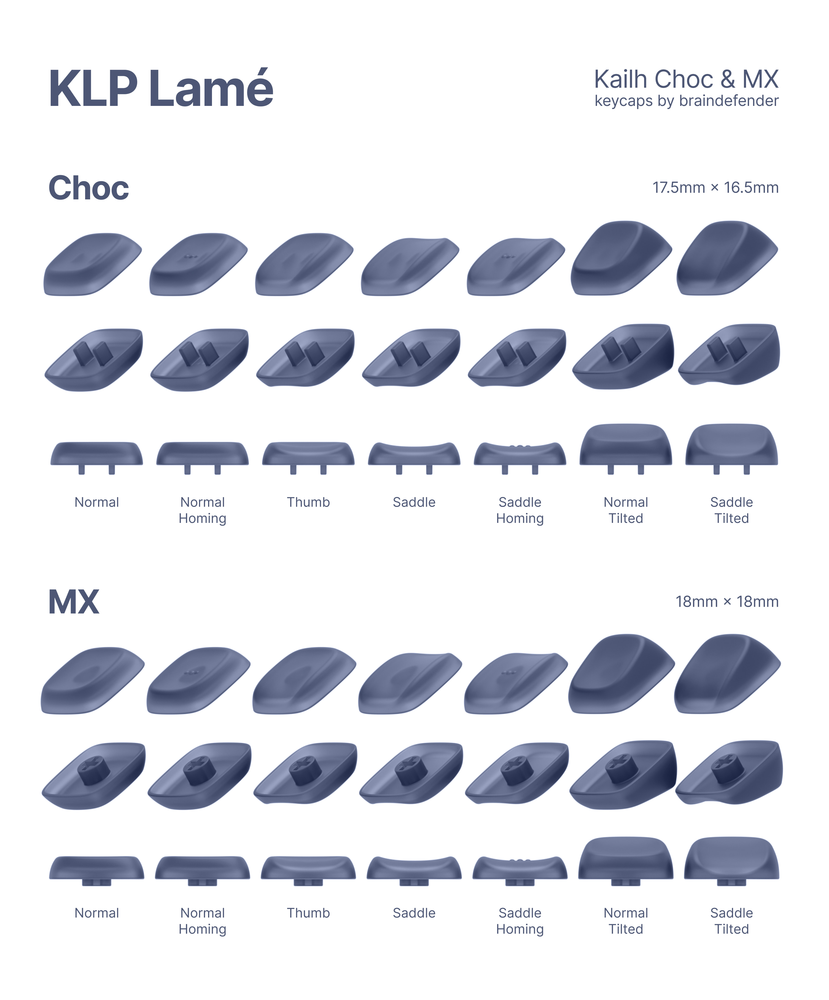
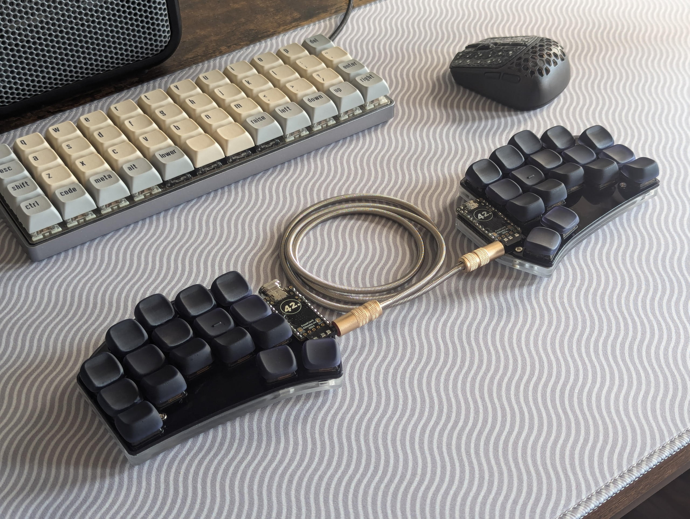
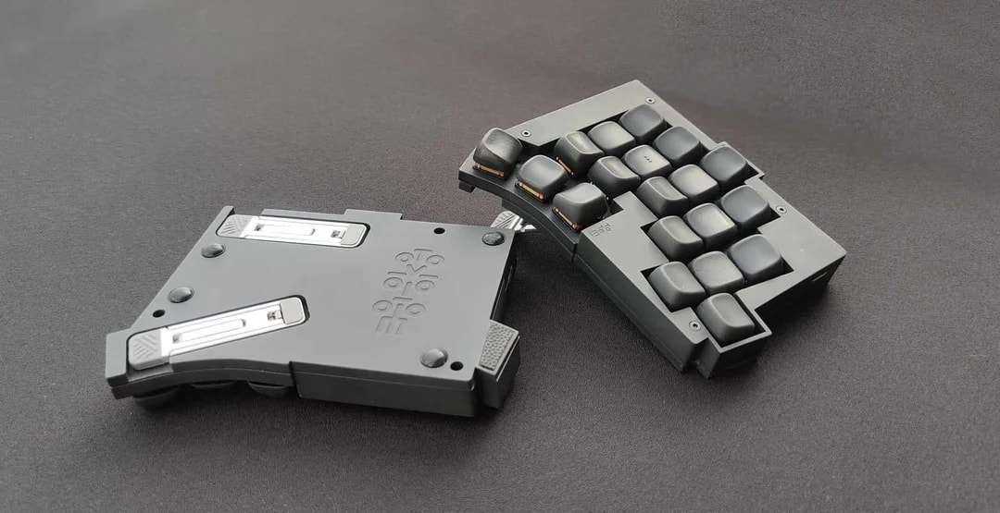
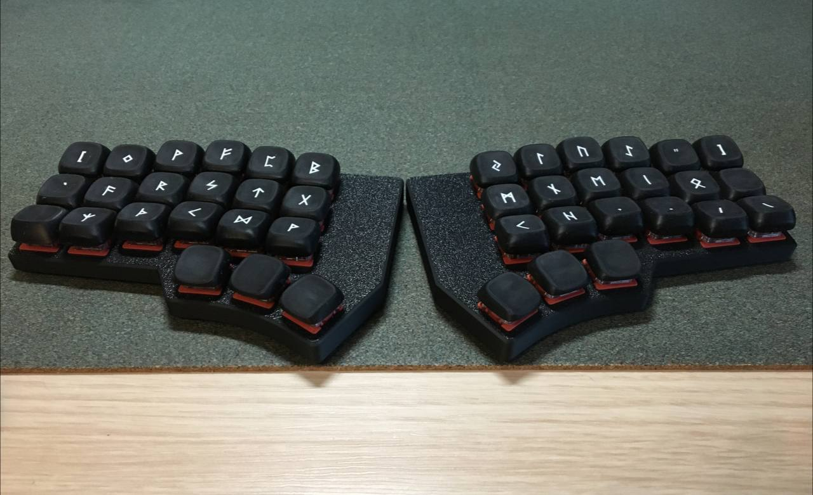
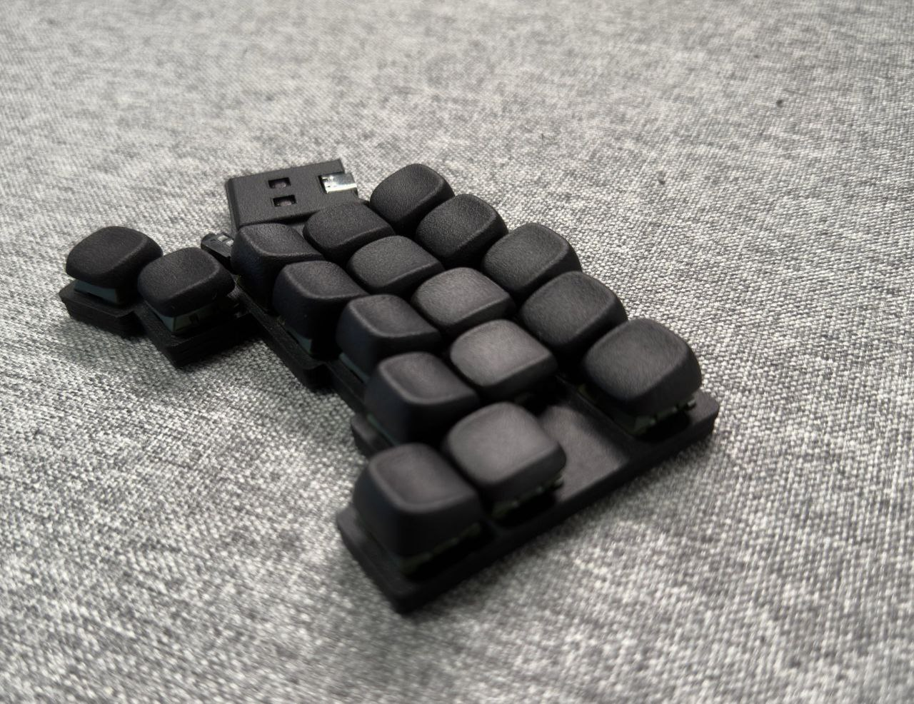

# KLP Lamé — Kailh Choc & MX Keycaps

Sculpted and curved keycaps for Kailh Choc and MX switches. Here is a project structure:

| Folder         | Description                                                                                   |
| :------------- | :-------------------------------------------------------------------------------------------- |
| **Assets**     | Various images and actual photos of keycaps                                                   |
| **Blender**    | Blender files for [Combined Versions](#how-to-print) and rendering preview image              |
| **Fusion 360** | Source files for [Autodesk Fusion 360](https://www.autodesk.com/products/fusion-360/overview) |
| **Production** | Combined STL 3D models suitable for 3D-Printing services (like [JLC3DP](https://jlc3dp.com))  |
| **STEP**       | 3D models in STEP format for any CAD or Slicer software                                       |
| **STL**        | 3D models in STL format for any CAD or Slicer software                                        |

> `STEP` and `STL` folders contain all combinations of Choc/MX Stem + Choc/MX Size. There is also `90 deg Rotated` variants for Choc Stem.

There are currently 7 variants of keycaps:
| Variant           | Description                                                                         |
| :---------------- | :---------------------------------------------------------------------------------- |
| **Normal**        | Just a flat keycap profile with a small recess, that is soothing for fingers        |
| **Normal Tilted** | Same as Normal, but top profile has a 15° tilt and 0.5mm upward height compensation |
| **Normal Homing** | Has three little bumps that is useful to determine home positions                   |
| **Thumb**         | Same as Normal, but top profile has a cut along down side                           |
| **Saddle**        | Same as Thumb, but top profile has two symmetrical cuts                             |
| **Saddle Tilted** | Tilted version of Saddle. Same 15° and height compensation                          |
| **Saddle Homing** | Has three little bumps that is useful to determine home positions                   |

## What keycaps do I need for my keyboard?

First, you should choose Choc/MX stem (depends of your switches) 
Second, choose Choc/MX size that is suitable for your keyboard. 
Then, pick what keycap variants you want for your columns/rows/thumbs. It depends entirely of your choice.

For corne-like keyboards with 36-keys I use:

| Amount | Kind          | Purpose                     |
| -----: | :------------ | :-------------------------- |
|     20 | Saddle Tilted | For top and bottom rows     |
|     16 | Saddle        | For home row + 6 for thumbs |

or

| Amount | Kind          | Purpose                 |
| -----: | :------------ | :---------------------- |
|     20 | Normal Tilted | For top and bottom rows |
|     10 | Normal        | For home row            |
|      6 | Thumb         | For thumbs              |

## How to print?

It is best to position the model more vertically to avoid tactile layer-to-layer bumps. Personally, I use 45° or 75° angle, but it's up to you.

`Production/Choc` and `Production/MX` contains files that you can use in any 3D-printing service like [JLC3DP](https://jlc3dp.com) or [PCBWay](https://www.pcbway.com/rapid-prototyping/3d-printing/). Currently, `Production` folder contain only `Choc Stem + Choc Size` and `MX Stem + MX Size` respectively. You can download them directly using links below:

| File          | Choc                           | MX                           | Kinds                                                                        |
| :------------ | :----------------------------- | :--------------------------- | ---------------------------------------------------------------------------- |
| Normal Part 1 | [Download][normal-part-1-choc] | [Download][normal-part-1-mx] | - 6 × Normal Tilted - 3 × Normal                                         |
| Normal Part 2 | [Download][normal-part-2-choc] | [Download][normal-part-2-mx] | - 4 × Normal Tilted - 3 × Thumb - 1 × Normal Homing - 1 × Normal |
| Saddle Part 1 | [Download][saddle-part-1-choc] | [Download][saddle-part-1-mx] | - 6 × Saddle Tilted - 3 × Saddle                                         |
| Saddle Part 2 | [Download][saddle-part-2-choc] | [Download][saddle-part-2-mx] | - 4 × Saddle Tilted - 4 × Saddle - 1 × Saddle Homing                 |

[normal-part-1-choc]: ./Production/Choc/Choc_Stem_Choc_Size_Normal_Part_1.zip
[normal-part-2-choc]: ./Production/Choc/Choc_Stem_Choc_Size_Normal_Part_2.zip

[saddle-part-1-choc]: ./Production/Choc/Choc_Stem_Choc_Size_Saddle_Part_1.zip
[saddle-part-2-choc]: ./Production/Choc/Choc_Stem_Choc_Size_Saddle_Part_2.zip

[normal-part-1-mx]: ./Production/MX/MX_Stem_MX_Size_Normal_Part_1.zip
[normal-part-2-mx]: ./Production/MX/MX_Stem_MX_Size_Normal_Part_2.zip

[saddle-part-1-mx]: ./Production/MX/MX_Stem_MX_Size_Saddle_Part_1.zip
[saddle-part-2-mx]: ./Production/MX/MX_Stem_MX_Size_Saddle_Part_2.zip

## Can I use these models for a production and sale?

Yes. But you must leave a mention of this repository/author to end users.

## Can I modify, fork, post (or whatever) these models?

Yes. Rules are the same. Give a credit to the author.

## Changelog

v1.4
- [Models] Updated Choc Stem to be compatible with silent choc switches.
- [Project] Added Choc_Stem + MX_Size 90° rotated variants (both STL and STEP).
- [Production] Increased surface area of connected parts to improve print stability.

v1.3
- [Models] Added mix and match variants for Choc/MX Stem + Choc/MX Size.
- [Project] Updated folder structure to accomodate mix and match variants.
- [Project] Removed Lychee (legacy) project files.

v1.2
- [Models] Added Choc version with 90° rotated stem.

v1.1

- [Models] Added chamfers along inner bottom line (1.2mm for Choc and 1.4mm for MX).
- [Project] Added separate Fusion project files.
- [Project] Updated Images & Photos.

> Now the models are also suitable for FDM 3D Printers. But I still recommend using SLA for better quality.

v1.0

- Initial Release.

## Images & Photos

### From various awesome people

By [u/socopopes](https://www.reddit.com/user/socopopes/) from [Reddit](https://www.reddit.com/r/ErgoMechKeyboards/comments/1dx9d7j/down_14_more_keys_only_34_more_to_go/)

By [u/bert_plasschaert](https://www.reddit.com/user/bert_plasschaert/) from [Reddit](https://www.reddit.com/r/ErgoMechKeyboards/comments/1dmirsg/totem_tenting_bottom_plate/)

By [proostas](https://t.me/proostas) from [Ergonaut Keyboards Ru](https://t.me/ergonautkb_ru)

By unknown from [KlavaOrgWork](https://t.me/klavaorgwork)

### Original photos

> The keyboard is my side-project [Lapka](https://github.com/braindefender/lapka)

> The keyboard is [Cantor Remix](https://github.com/nilokr/cantor-remix)

## Contacts

@braindefender (preferably, [Telegram](t.me/braindefender), but also [GMail](mailto:braindefender@gmail.com) and [Reddit](https://www.reddit.com/user/braindefender/))
